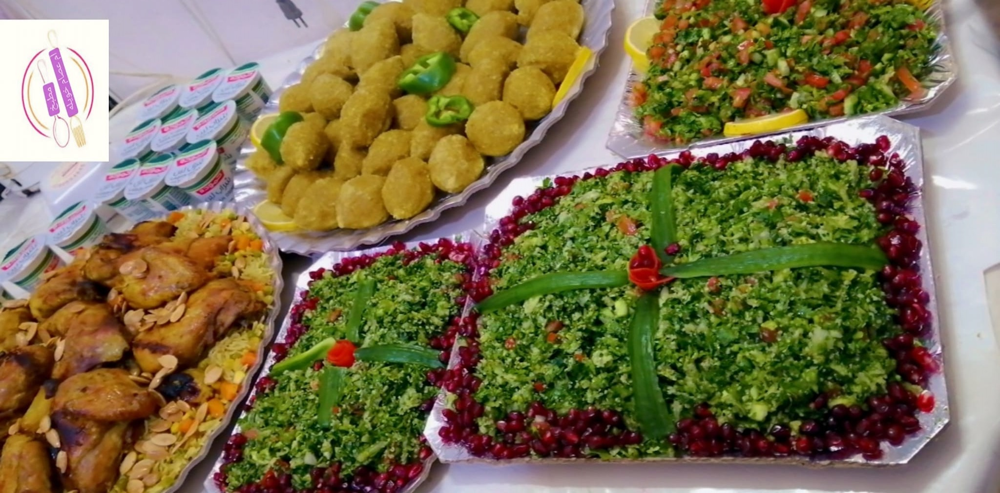
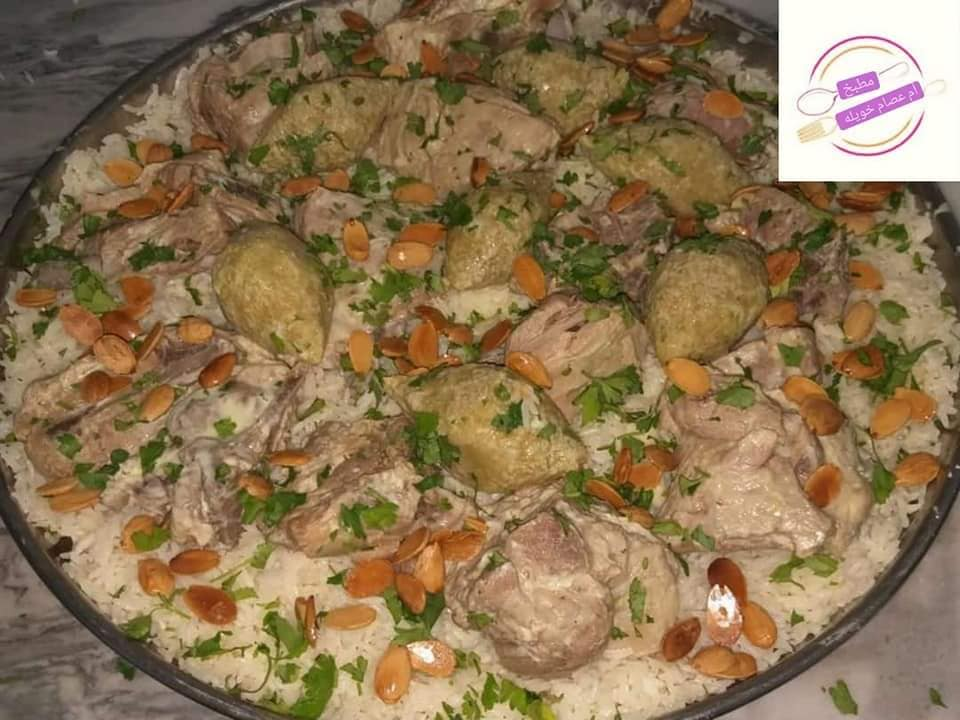
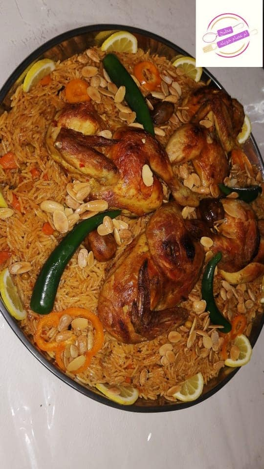
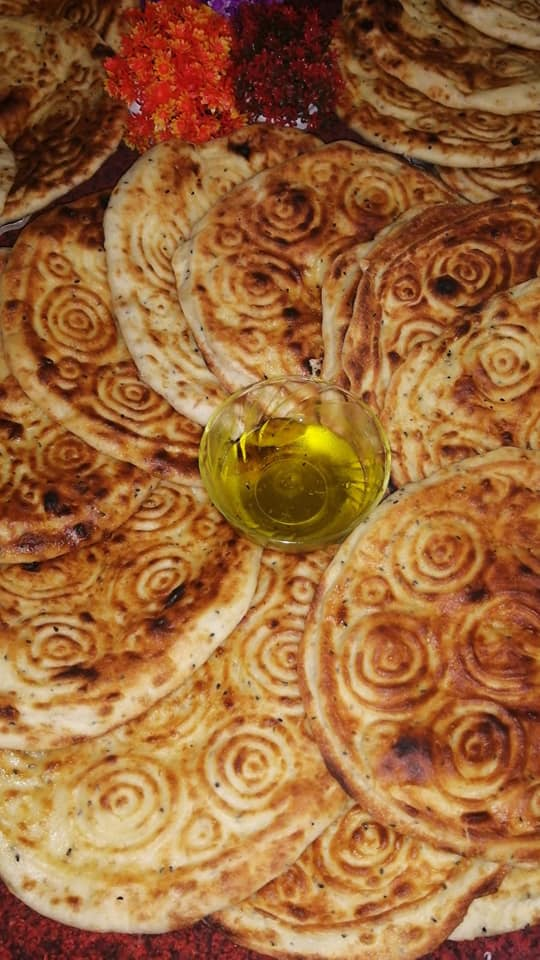
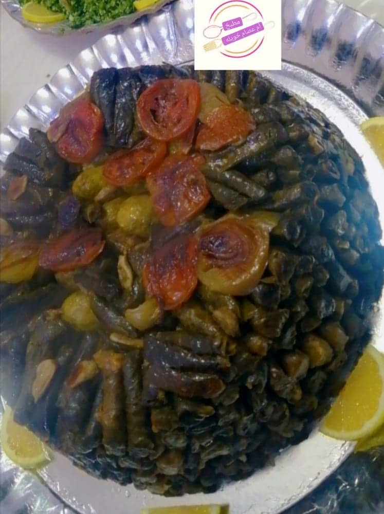
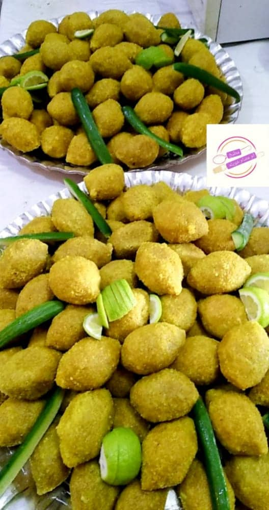

#  Jordanian-Food

**Jordan's Popular Food**

## Each country is distinguished from the others by popular dishes prepared by ancestors since ancient times, and it has been passed down from generation to generation, but Jordan has a special taste.
  

## Our dishes: 
- Mansaf  

- Kabseh 
 

- Fataier 

- Bread with onion       
- Eid Bread 
- Dawali 
- Kbab  

:phone: Contact us +962780604948

:clock1: available 8:00 am - 10:00 pm
